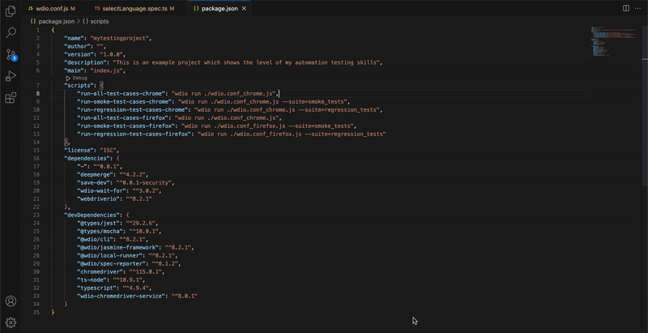
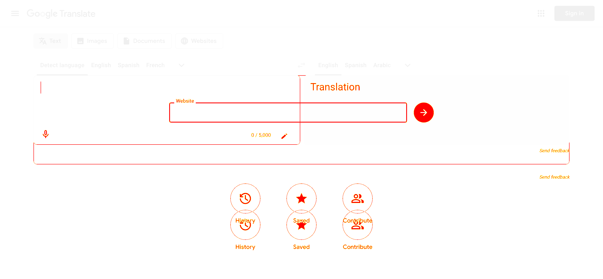

# qa-auto-portfolio-project

**qa-auto-portfolio-project** created to check the functionality and appearance of the [Google Transalte](https://translate.google.com/) site and works on the WebdriverIO automation framework. Autotests check the functionality of a site on Chrome and Firefox browsers. In addition to functional tests, there are also non-functional tests for checking appearance by comparing screenshots (UI Regression Tests)

> [!NOTE]
> The project was created to demonstrate my test automation skills, there was no goal to cover all functionality and views of Google Translate

## Features 
- Executing autotests separatly by suite name (Smoke or Regression/UI Comparison)
- Running autotests on Chrome and Firefox browsers
- UI Comparison autotests that allows to compare current view with predefined scrennshot 
<!--- Remote autotests run on CircleCI -->

## Demo
- **Autotests run example**

- **UI Comaprison diff screenshot example**


## Structure
- Folder with function test cases `google-translate-autotests/tests/functional-autotests`
- Folder with non-function test cases (UI Comparison) `google-translate-autotests/tests/non-functional-autotests`
- Folder with page objects `google-translate-autotests/page-objects`
- Folder with helpers `google-translate-autotests/helpers`
- Folder with test data (files, images) `google-translate-autotests/data`

## Setup project and run autotests locally ⚙️
### 1. Precondition:
- Installed Chrome browser
- Installed Firefox browser
- Downloaded [Node.js and NPM](https://radixweb.com/blog/installing-npm-and-nodejs-on-windows-and-mac)

### 2. Setup project:
- Install node modules using command:
```
npm install
```

### 3. Run tests:
To run **all tests** on **Chrome** or **Firefox** naviagte to the package.json and start script `run-all-test-cases-chrome` or `run-all-test-cases-firefox`. You can use next commands to run tests via terminal:

- Run all tests for **Chrome**
```
wdio run ./wdio.conf_chrome.js
```
- Run all tests for **Firefox**
```
wdio run ./wdio.conf_firefox.js
```

Also you can run only **smoke** or **regression** tests using appropriate package.json scripts or by adding `--suite` to the command. Here are examples:

- Run **Smoke** tests on **Chrome** - script `run-smoke-test-cases-chrome` or command
```
wdio run ./wdio.conf_chrome.js --suite=smoke_tests
```
- Run **Regression** tests on **Firefox** - script `run-regression-test-cases-firefox` or command
```
wdio run ./wdio.conf_firefox.js --suite=regression_tests
```
- Run **UI Comparison** tests for **Chrome** - script `run-ui-comparison-test-cases-chrome` or command
```
wdio run ./wdio.conf_chrome.js --suite=ui_comparison_tests
```

## Built With 🛠
- [TypeScript language](https://www.typescriptlang.org/) - Used to write automation test cases.
- [NPM](https://www.npmjs.com/) - For managing project's dependencies, including WebdriverIO and any other libraries required for the automation.
- [WebdriverIO](https://webdriver.io/uk/) - Serves as the core automation framework for the project, enabling the simulation of user interactions and testing scenarios on the web application.
- [Pixelmatch library](https://github.com/mapbox/pixelmatch) - is utilized for visual regression testing. It allows to compare screenshots of your app UI, detecting any unexpected visual differences.

## License 📋

```
MIT License

Copyright (c) 2023 jectoric

Permission is hereby granted, free of charge, to any person obtaining a copy
of this software and associated documentation files (the "Software"), to deal
in the Software without restriction, including without limitation the rights
to use, copy, modify, merge, publish, distribute, sublicense, and/or sell
copies of the Software, and to permit persons to whom the Software is
furnished to do so, subject to the following conditions:

The above copyright notice and this permission notice shall be included in all
copies or substantial portions of the Software.

THE SOFTWARE IS PROVIDED "AS IS", WITHOUT WARRANTY OF ANY KIND, EXPRESS OR
IMPLIED, INCLUDING BUT NOT LIMITED TO THE WARRANTIES OF MERCHANTABILITY,
FITNESS FOR A PARTICULAR PURPOSE AND NONINFRINGEMENT. IN NO EVENT SHALL THE
AUTHORS OR COPYRIGHT HOLDERS BE LIABLE FOR ANY CLAIM, DAMAGES OR OTHER
LIABILITY, WHETHER IN AN ACTION OF CONTRACT, TORT OR OTHERWISE, ARISING FROM,
OUT OF OR IN CONNECTION WITH THE SOFTWARE OR THE USE OR OTHER DEALINGS IN THE
SOFTWARE.
```